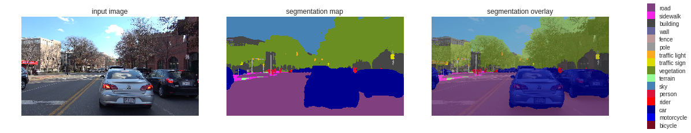

# Semantic-Segmentation
This repository contains a semantic segmentation implementation using DeepLab, which is a state-of-the-art deep learning model for semantic segmentation. And here we are doing semantic segmentation on a driving scene.In the driving context, we aim to obtain a semantic understanding of the front driving scene throught the camera input. This is important for driving safety and an essential requirement for all levels of autonomous driving.It is inspired MIT deep learning from which I learned so much abou Deep Learning.

Semantic Segmentation

You can find the DeepLab on github through this link 
https://github.com/tensorflow/models/tree/master/research/deeplab
